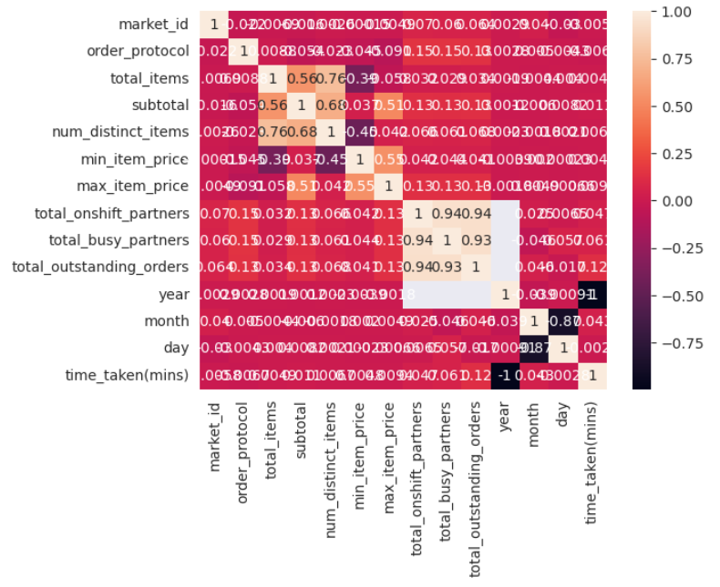
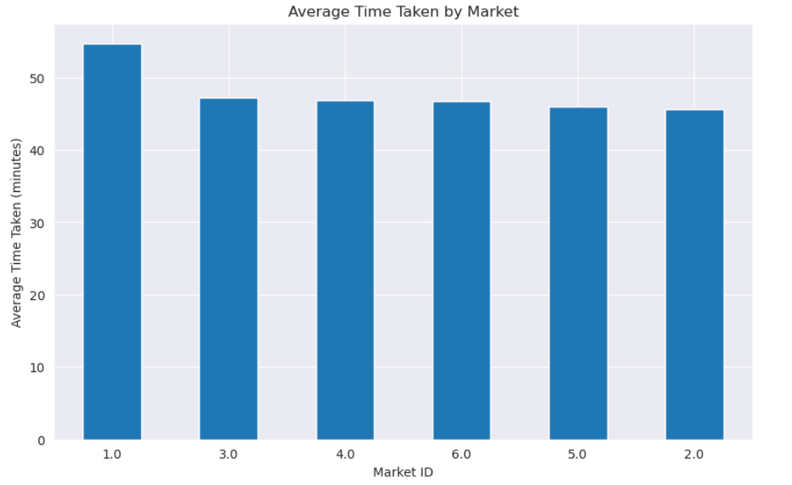

# BigDataProject-ITCS6100

# Team

## Members:
- Ramya Jampani
- Chetan Subhash Chunduru
- Himanshi Khatri
- Revanth Kumar Galla
- Satya Sai Rajesh Parvatareddy

## Communication plan to include project artifact repository:
Methods of communication :- e-mail, in-person(once a week)

Communication response times:- Same day

Meeting attendance:- After looking into everyone’s schedule we had decided to meet every Wednesday either virtual or in-person to discuss the progress of the project and attendance to this is mandatory.

Running meetings:- Virtual

Meeting preparation: We decided to come prepared to the meetings so that we can use the time in the most efficient way.

Version control: By creating pull requests, team members can push all of their modifications to the artifact, which are then assessed by their peers and merged. 
Git link(https://github.com/hkholic13/BigDataProject-ITCS6100)

Git link: [https://github.com/hkholic13/BigDataProject-ITCS6100](https://github.com/hkholic13/BigDataProject-ITCS6100)

# Selection of data to analyze

We will carefully select the domain and data for our project, which in this case, will be the "Porter Delivery Time Estimation" dataset provided by the competition organizers. We will analyze the dataset and understand its structure, features, and potential use cases for Delivery Time Prediction, Order Volume Analysis, Customer Satisfaction Analysis, Delivery Performance Analysis, Vendor Performance Analysis, Geographic Analysis, Seasonal Analysis.

Kaggle Link: [https://www.kaggle.com/datasets/ranitsarkar01/porter-delivery-time-estimation](https://www.kaggle.com/datasets/ranitsarkar01/porter-delivery-time-estimation)

## Files:
Each row in this file corresponds to one unique delivery. Each column corresponds to a feature as explained below

- market id: integer id for the market where the restaurant lies
- created at: the timestamp at which the order was placed
- actual delivery time: the timestamp when the order was delivered
- store_primary_category: category for the restaurant
- order protocol: integer code value for order protocol(how the order was placed le: through porter, call to   restaurant, pre booked, third part etc)
- total items subtotal: final price of the order
- num_distinct items: the number of distinct items in the order
- actual delivery time: the timestamp when the order was delivered
- store_primary_category: category for the restaurant
- order protocol: integer code value for order protocol(how the order was placed le: through porter, call to restaurant, pre booked, third part etc)
- total items subtotal: final price of the order
- num_distinct items: the number of distinct items in the order
- min_item_price: price of the cheapest item in the order
- max_item_price: price of the costliest item in order
- total_onshift_partners: number of delivery partners on duty at the time order was placed
- total_busy_partners: number of delivery partners attending to other tasks
- total outstanding_orders: total number of orders to be fulfilled at the moment

# Business Problem or Opportunity, Domain Knowledge

- The dataset titled "Porter Delivery Time Estimation" available on Kaggle provides a prospect for data-driven analysis in the realm of food delivery by presenting a business problem. Food delivery enterprises, including restaurants, cafes, and food delivery platforms, encounter the difficulty of accurately predicting and controlling delivery durations to ensure a gratifying encounter for their clientele. Precise estimation of delivery time is critical for fulfilling customer demands, guaranteeing punctual deliveries, and upholding customer contentment.

- The "Porter Delivery Time Estimation" dataset presents a valuable opportunity for businesses to utilize existing data in order to extract insights and arrive at well-informed decisions. The dataset can be analyzed and valuable insights can be derived by utilizing domain knowledge related to the food delivery industry, logistics, and customer preferences. Through an analysis of the variables that impact delivery time, discernment of patterns and trends in order volume, customer satisfaction, delivery performance, and vendor performance, enterprises can optimize their operational processes, enhance their customer service, and augment their competitive edge.

- The interpretation of data and discovery of significant insights can be facilitated through the utilization of domain knowledge in fields such as transportation and logistics, customer behavior, and market trends. An instance of optimization for delivery routes and schedules in businesses can be achieved by comprehending the influence of weather conditions, traffic patterns, and distance on delivery time. Acquiring an understanding of customer preferences, including peak hours and days, can aid businesses in effectively strategizing their resource allocation and operational procedures. Familiarity with market trends and seasonal patterns can assist enterprises in adapting their tactics and advertising campaigns to accommodate evolving consumer preferences.

- In general, the utilization of domain expertise and examination of the "Porter Delivery Time Estimation" dataset offers a prospect for enhancing delivery time estimation, streamlining operations, augmenting customer contentment, and attaining a competitive edge in the food delivery sector.

Link to domain data: [https://porter.in/about-us?landing_page=nw&utm_content=nw](https://porter.in/about-us?landing_page=nw&utm_content=nw)

## Business Problem/Opportunity: Improving Delivery time

### Domain Knowledge:
- Domain knowledge in market trends:

    The comprehension of market trends and seasonality is crucial for businesses to adapt their strategies and promotional activities to cater to the evolving demands of their customers. The identification of seasonal variations in demand for specific types of cuisine or food products can aid enterprises in devising appropriate strategies for inventory management, staffing, and promotional activities.

    Conducting competition analysis by monitoring market trends and scrutinizing the products, pricing, and promotional strategies of rivals can enable enterprises to maintain their competitiveness. The process may encompass the surveillance of the market for novel participants, the discernment of customer inclinations, and the comparison with rivals to pinpoint opportunities for enhancement and distinction.

    Market segmentation is a crucial strategy for businesses to comprehend the distinct customer segments and their preferences. This understanding enables businesses to customize their offerings and promotions to cater to the unique requirements of each segment. The process may entail scrutinizing data pertaining to customer demographics, preferences, and behaviors to discern prospects for targeting particular market segments through tailored strategies.

- Domain knowledge in Transportation and logistics

    Real-time traffic and weather data may be used to determine the shortest and most direct routes for vehicles. This involves evaluating information such as traffic patterns, road conditions, and weather forecasts to decide the most effective route for delivery to take. By optimizing delivery routes, businesses may reduce delays, save money on transportation costs, and ensure that items reach on time.

    By allocating delivery trucks to the appropriate jobs, planning routine maintenance, controlling fuel consumption, and utilizing tracking and monitoring systems, fleet management ensures that they are utilized effectively. This entails determining the efficiency of each vehicle, the amount of gasoline it consumes, and when maintenance is due. Businesses can ensure their drivers are secure and their cars aren't being misused by deploying tracking and monitoring technologies.

    Businesses must select the appropriate mode of transportation for their delivery since different modes of transportation have varied prices, benefits, and restrictions. For instance, when moving products over short distances, employing trucks is typically the most flexible and economical alternative, whereas air transportation is quicker but more expensive and less versatile.

- Domain knowledge in Customer Conduct:

    Businesses may better manage their resources and schedule deliveries to make sure they arrive on time during peak times by being aware of when consumers are most likely to place purchases. To find trends in consumer behavior, this entails analyzing data such as order history, transaction volume, and delivery timings. Businesses may prepare ahead of time and make sure they have adequate employees and inventory to satisfy demand by knowing when consumers are most likely to place orders.

    Businesses can learn how to better serve their customers and grow by looking at consumer purchase trends, such as the most popular days of the week or the most frequently requested items. This entails gathering and researching information such as order histories, menu choices, and client testimonials. Businesses may better meet consumer demands and enhance the overall experience by learning what customers love and dislike about their goods and services.

    Customer feedback and reviews: Analyzing customer feedback and reviews can provide valuable insights into customer behavior and preferences. This can involve identifying common complaints, feedback on delivery time, and overall satisfaction levels to pinpoint areas for improvement and make data-driven decisions.

##  Research Objectives and Question(s) (what you are trying to describe or predict with the data)

The team formulated research questions that guide the analysis and investigation. These questions align with their research objectives and are intended to address the identified business challenge or opportunity.
For example, 
- What are the key factors that influence the delivery time of orders placed through the Porter platform? Can we identify any patterns or trends in the data that can help optimize delivery operations and reduce delivery time?

- How does the order protocol (i.e., how the order was placed) affect the delivery time? Are there any significant differences in delivery time based on different order protocols, such as orders placed through Porter, call to restaurant, pre-booked, or third-party platforms?

- How do the restaurant's primary category and the total number of distinct items in an order impact the delivery time? Are certain restaurant categories or order sizes associated with longer or shorter delivery times?

- Can we develop a predictive model that accurately estimates the delivery time for orders based on features such as distance, weather conditions, order characteristics, and partner availability? How well can the model predict the actual delivery time?

- What is the relationship between the prices of items in an order (i.e., min_item_price, max_item_price) and the delivery time? Do higher or lower prices of items in an order have an impact on the delivery time?

- How do the number of on-shift and busy delivery partners at the time of order placement affect the delivery time? Can we identify any patterns or trends that can help optimize partner allocation and reduce delivery time?

- What is the impact of the total number of outstanding orders at the moment on the delivery time? Does a higher number of outstanding orders result in longer delivery times?

- Are there any seasonal or time-based trends in the data that affect the delivery time? How does the delivery time vary based on different days of the week, time of day, or month of the year?

- Can we identify any customer behavior patterns related to delivery time, such as peak hours or days for ordering, preferences for certain order protocols or restaurant categories, or preferences for higher or lower-priced items?

- How does the delivery time impact customer satisfaction? Can we quantify the relationship between delivery time and customer satisfaction scores, and identify any opportunities for improving customer satisfaction through optimizing delivery time?

- Comparison with other delivery systems available in the market to show the trends and to compare the differences.

## Deliverable 2

### Data Understanding

#### Exploratory Data Analysis

We have used AWS SageMaker Notebook instances to conduct exploratory data analysis on our Porter data. During this process, we developed code to perform null value checks on both rows and columns of the dataset. Tried to understand the data using different visualizations. Below are the functions we have used to understand data.

- The function known as check_missing_values is tasked with the responsibility of ascertaining the presence or absence of any missing values within the given dataset. Consequently, the function produces a binary output denoting the presence or absence of null values within the dataset. In the event that there are any absent values, the proportion of absent values from every column is exhibited.

- The function named "check_duplicates" is designed to conduct a search within a given dataset to identify rows that exhibit complete similarity with each other. The function yields a boolean output denoting the presence or absence of identical rows within the dataset. If there exist replicated rows, the aggregate count of such duplicated rows is also displayed.

- The responsibility of computing summary statistics for the numerical columns of the dataset lies with the function named "Get_statistics". The aforementioned statistical measures, namely the mean, median, mode, standard deviation, minimum and maximum values, and quartiles, are commonly utilized in data analysis. The resulting output is a dataframe that includes the aforementioned statistics.

- The function get_histogram utilizes the quantitative variables present in the dataset to produce histograms. The matplotlib library proves to be a valuable tool in the creation of histograms.

#### Dashboard

We have used Amazon Quick Sight to build our dashboard. We have made use of the different visualizations available in the Quick Sight to understand the data better.The dashboard pdf and dashboard sheets can be found in the  deliverable2 folder of the repo.

#### Insights generated
- The analysis reveals that the top three num_distinct_itemss for total time_taken(mins) are 2, 1, and 3, with 2,736,542, 2,371,459, and 2,003,903 respectively. The top three num_distinct_itemss for total total_onshift_partners are 2, 1, and 3, with 2,369,580, 1,876,327, and 1,756,693 respectively, while the total total_onshift_partners are 8,076,397. The bottom three num_distinct_itemss for total time_taken(mins) are 20, 17, and 18, with 53, 154, and 198 respectively, and the bottom three num_distinct_itemss for total total_onshift_partners are 20, 17, and 19, with 55, 82, and 95 respectively.

- The top three order_protocols for total count of records are 1, 3, and 5, with 54,725, 53,199, and 44,290 respectively, while the bottom three order_protocols for total count of records are 7, 6, and null, with 19, 794, and 995 respectively. The total count of records for Feb 19, 2015 decreased by 99.98% (-4,117) from 4,118 to 1. The bottom three order_protocols for total total_items are 7, 6, and 2, with 56, 1,987, and 75,660 respectively.

- The highest day is Feb 2015 with a total count of actual_delivery_time of 9,149.

### Data Preparation

In the process of preparing data for analysis we have used the following.

- The remove_outliers function is designed to eliminate any outliers present in the dataset. The z-score technique is employed to detect and eliminate outliers from the dataset. The input parameters for the function include a dataframe and a threshold value. In statistical analysis, an outlier is identified as any data point that exhibits a z-score exceeding the threshold value, and subsequently excluded from the dataset.

- The impute_missing_values function is designed to address missing values in a dataset by utilizing the mean value of the corresponding column for imputation purposes. The function accepts a dataframe as an argument and proceeds to substitute any missing values with the mean value of the corresponding column.

- The normalize_data function performs z-score normalization on the dataset to normalize the data. The function accepts a dataframe as an argument and produces a normalized dataframe as output. The z-score normalization technique is utilized to standardize data by performing two operations on each column: subtracting the mean value and dividing by the standard deviation.

### Machine Learning & Analytics
XGBoost (Extreme Gradient Boosting) is a popular machine learning algorithm that is widely used for regression and classification tasks. It is an optimized implementation of gradient boosting, which is an ensemble learning technique that combines multiple weak predictive models (often decision trees) to create a stronger overall predictive model.In the context of regression, the XGBoost regressor is a variant of the XGBoost algorithm specifically designed for predicting continuous numerical values. 

In project context,
- The XGBoost regressor is imported from the xgboost library.
- An XGBoost regressor model is created with specified hyperparameters (max_depth=3, learning_rate=0.1, and n_estimators=100).
- The model is trained using the training data (X_train and y_train).
- Predictions are made on the test data (X_test) using the trained model, and the predicted values are stored in y_pred.
- Evaluation metrics, mean absolute error (mae) and R-squared score (r2), are calculated using the predicted values and the actual target values (y_test).
- Finally, the MAE and R-squared score are printed to assess the performance of the model.

### Evaluation:

- The mean_absolute_error function from scikit-learn assists in calculating the average difference between the predicted and actual values. This function is helpful for determining how accurately a model is performing.

- On the other hand, the R-squared (R2) score, which represents the percentage of the target variable's variability that can be explained by the input variables, is calculated using the r2_score function from the scikit-learn package. A higher score indicates a better match between the model and the data; the value runs from 0 to 1. The R2 score essentially serves as a gauge of how effectively the model can identify patterns in the data and forecast the target variable.

### Optimization

- We started with initializing the regression XGBoost model with default settings to predict the target variable. The data was then processed to make sure it could be used with the model. This involves dealing with missing data, null values, eliminating negative values from certain columns, and changing numerical properties using a logarithmic function. Using LabelEncoder, categorical features are also transformed into numerical values.

- Using the train_test_split function from scikit-learn, we then divided the dataset into two groups for training and testing. We fitted the XGBoost model to the target variable using the training data. The model's predictions were then obtained using the predict technique on the test data.

- The performance of the model is then evaluated by calculating the MAE and R2 score metrics. This discrepancy is quantified by the average absolute difference (MAE) between actual and anticipated values. The R2 score, which is given as a percentage, indicates how much of the variance in the target variable can be explained by the model's input variables.

### Results
Mean absolute error:12.828135421180502
r2_score:0.0005775778642763685

### Future Work, Comments

## What was unique about the data?  Did you have to deal with imbalance? What data cleaning did you do? Outlier treatment?  Imputation?
- The dataset used in the analysis had some unique features that required specific data cleaning steps. One of these steps involved converting the 'created_at' and 'actual_delivery_time' columns to datetime format to enable the calculation of the time taken for delivery.

- Another important aspect was dealing with outliers in the numerical features. This was done using box plots to identify and remove any values that fell outside of the expected range. For instance, negative values in 'min_item_price', 'total_outstanding_orders', 'total_onshift_partners', and 'total_busy_partners' were removed from the dataset.

- Regarding missing values, the code implemented various imputation strategies based on the type of feature. For categorical features ('market_id', 'store_primary_category', 'order_protocol'), the most frequent value was imputed for missing values. For numerical features ('total_onshift_partners', 'total_busy_partners', 'total_outstanding_orders', 'time_taken(mins)'), the mean value was imputed for missing values.

- To evaluate the model's performance, the data was split into training and testing sets using a 70:30 ratio. The XGBoost algorithm was applied to the training data for regression modeling. Mean absolute error and R2 score were used to assess the model's performance on the test data.

## Did you create any new additional features/variables?
We have created a new feature called 'time_taken(mins)' is developed  representing the time taken for delivery in minutes. This feature is derived by calculating the difference between the 'actual_delivery_time' and 'created_at' columns, indicating the time elapsed between when an order was created and when it was delivered.

## What was the process you used for evaluation? What was the best result?
We have utilized an XGBoost regressor in our code for evaluating the performance of predictive model. the mean absolute error (MAE) & r2 score are calculated and considered as the evaluation metrics.

## What were the problems you faced? How did you solve them?
- Firstly, the code calculated the percentage of missing values for each feature in the dataset, and it was found that several features had missing values. These features were: 'market_id', 'store_primary_category', 'order_protocol', 'total_onshift_partners', 'total_busy_partners', 'total_outstanding_orders', and 'time_taken(mins)'.

- To solve this issue, the missing values were imputed with appropriate values. For categorical features ('market_id', 'store_primary_category', 'order_protocol'), the mode of the respective features was used to fill the missing values. On the other hand, for numerical features ('total_onshift_partners', 'total_busy_partners', 'total_outstanding_orders', 'time_taken(mins)'), the mean value was used to fill the missing values.

- After imputing the missing values, the dataset was further processed for analysis and modeling. This ensured that all the necessary data was available for accurate analysis and modeling.

## What future work would you like to do? 
- To improve the performance of the XGBoost model, we should perform hyperparameter tuning using techniques such grid search or random search to find the optimal combination of hyperparameters. Parameters like learning rate, maximum depth, number of estimators, subsample, and regularization can be tuned for a better results.

- In addition, we can explore additional feature engineering techniques to increase the predictive power of model. This can include creating new features based on domain knowledge or transforming existing variables to capture non-linear relationships. Interactions between variables, polynomial features, or any other feature transformations can also be considered to capture more complex patterns in data.

- To further improve the model's performance, we can experiment with ensemble modeling techniques such as bagging and boosting. Different ensemble methods, such as stacking or blending, can be tried to combine the predictions of multiple models.

- To obtain more reliable estimates of the model's performance, cross validation techniques can be implemented. This can help assess the model's generalization ability and decrease the risk of overfitting.

- Finally, regularization techniques like L1 regularization or L2 regularization can be applied to prevent overfitting and improve the model's generalization.

## Instructions for individuals that may want to use your work
- Install the required libraries before using the code: Ensure that your Python environment has the necessary libraries installed before using the code. The 'pip install xgboost' command may be used to install the xgboost library, which is utilized in this code, on your terminal or command prompt.

- Prepare the data: The code presupposes that the dataset is in a CSV file. The s3_csv_path variable must provide the path to your CSV file. Change it to reflect the location and filename of your dataset.

- Run the program: Use a Python environment with the necessary libraries installed to run the code. Either the script or each cell in a Jupyter Notebook can be executed.

- Interpreting the outcomes: After the code has completed running, you will see various metrics and visualizations. These reveal information about the dataset and how well the XGBoost regression model performed. In order to comprehend the data and assess the model's effectiveness, you should interpret the findings.

- Change the code (optional): If necessary, change the code to meet your unique needs. You may alter the data pretreatment procedures, investigate new visualizations, test out other machine learning models, or fine-tune the model parameters, for example.
